# Xeto Xchange

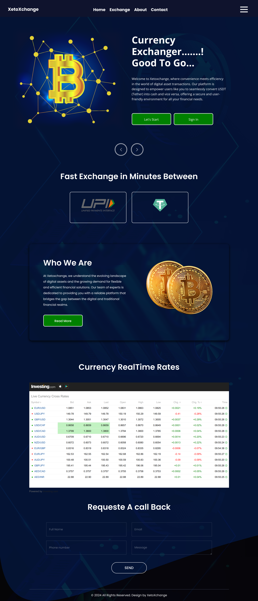

## Introduction
The **Xeto Xchange** is a web-based currency exchanger application, where convenience meets efficiency in the world of digital asset transactions. XetoXchange is designed to empower users like you to seamlessly convert USDT (Tether) into cash and vice versa, offering a secure and user-friendly environment for all your financial needs. XetoXchange understand the evolving landscape of digital assets and the growing demand for flexible and efficient financial solutions.

## Features
- **User-Friendly Interface**: Boasts an intuitive and user-friendly interface, ensuring a hassle-free experience for both novice and seasoned users. Whether you're new to cryptocurrency or a seasoned trader, Xeto is designed with you in mind.
- **Secure Environment**: User security is always on top priority. Xetoxchange employs state-of-the-art security measures to safeguard your transactions and personal information.
- **Transparent Process**: User can direct send exchange rate amount in admin bank account through QR code.
- **Admin Dashboard**: Fully functional dashboard where admin can monitor the user analytics records like active users, completed transations , pending transations information.

## Technologies Used
### Frontend:
    - : - Builds dynamic and responsive user interfaces.

### Backend:
 - : - Manages the backend, handling user requests and data flow.

### Database:
 - : - Stores user information and transation records.

## Usage
1. **Sign Up/Sign In**: Users need to create an account or log in.
2. **Currency Converter**: Users can convert currency top on latest price and can calculate his/her exchange amount via the platform.
3. **Transation Records**: The system keeps every transation records of each user on his/her system.
4. **Currency RealTime Rates**: Users can view every currency realtime rates without logging the system.
5. **Admin Dashoard**: Fully functional dashboard where admin can monitor the user analytics records like active users, completed transations , pending transations information.

## Screenshots

### Login-Page
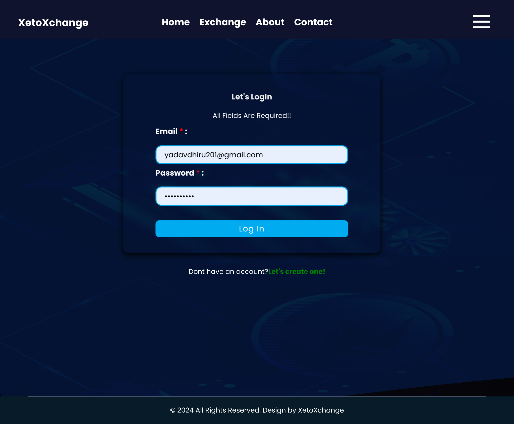

### SignUp-Page
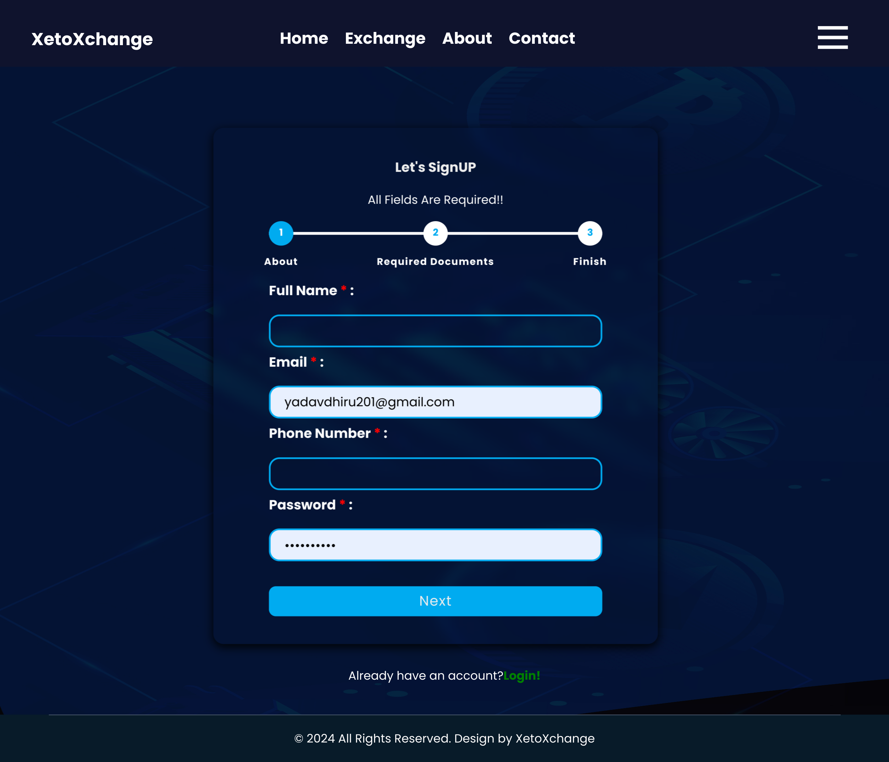

### Exchange-Page
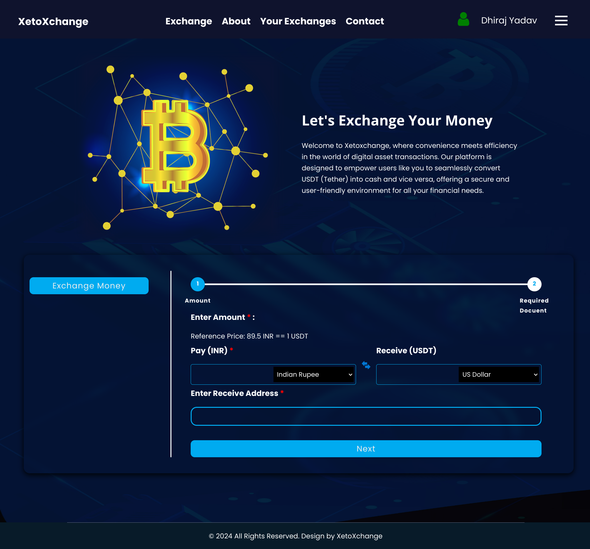

### About-Page
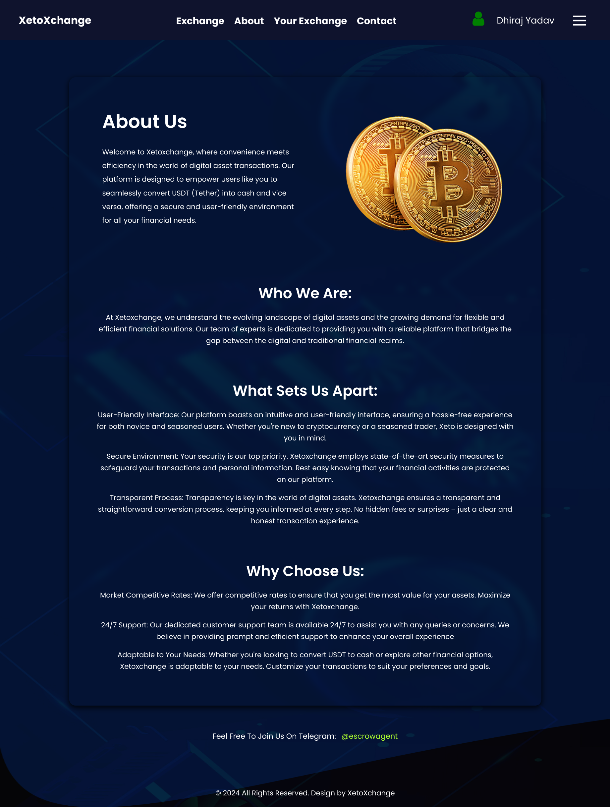

### Transation-Report-Page
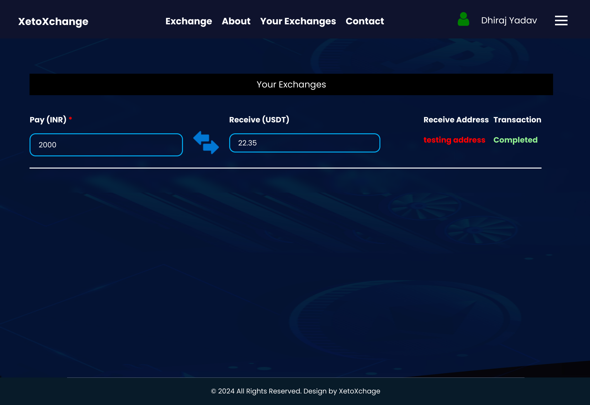

### Contact-Page
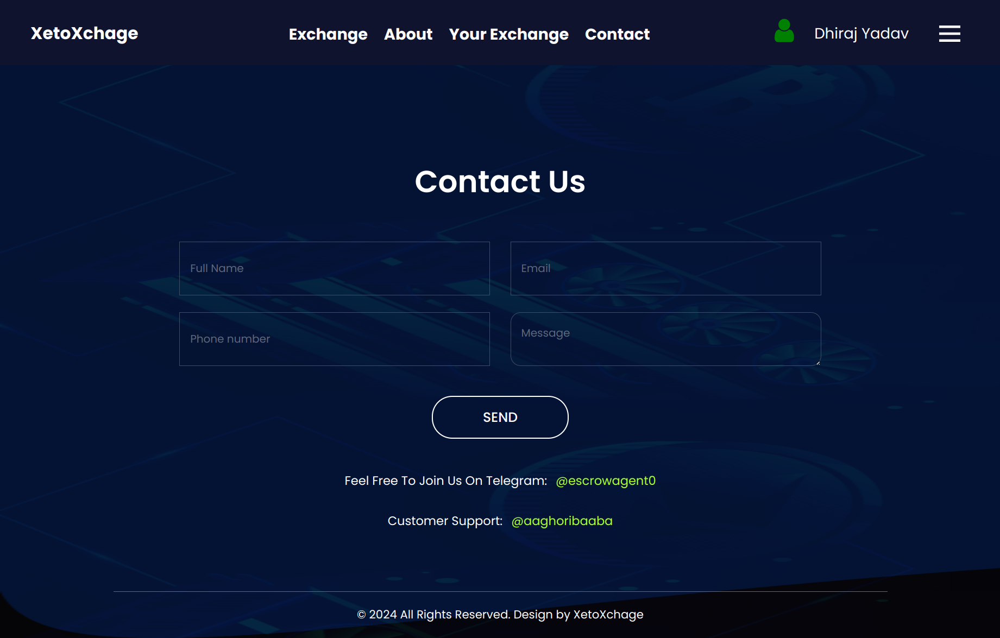

## Admin-Page : Screenshots

### Admin-Login-Page
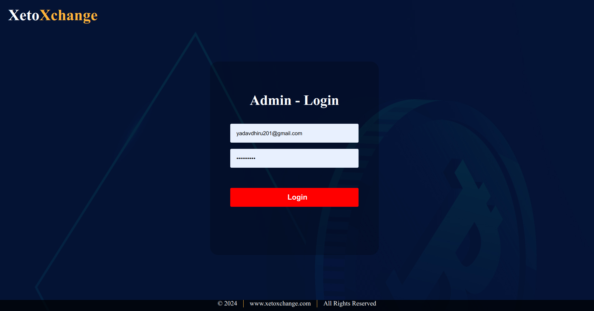

### Admin-Dashboard-Page
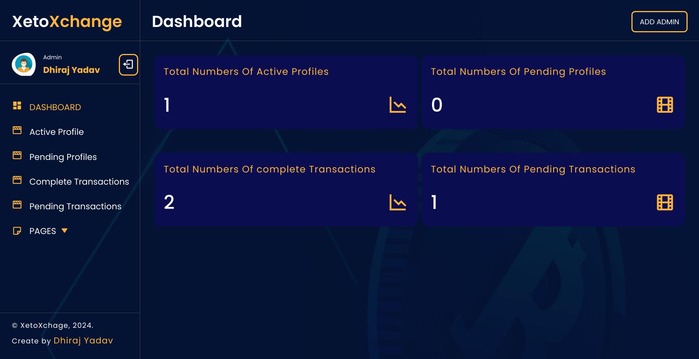

### Admin-Signup-Page
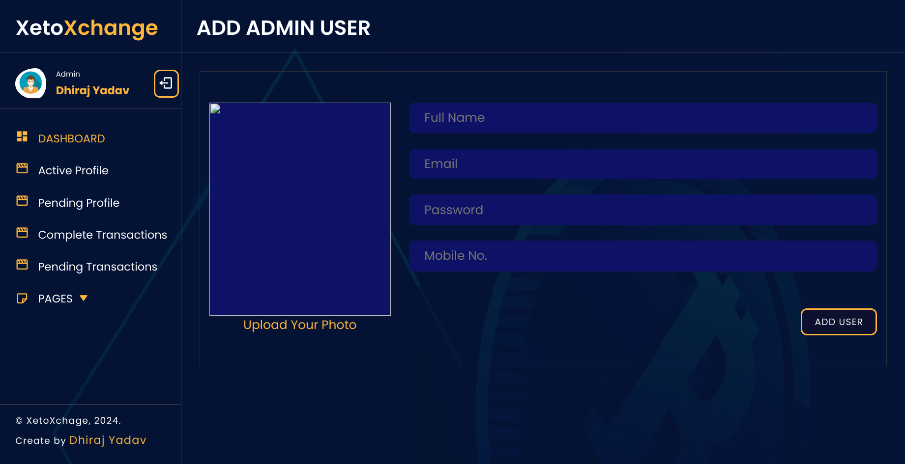

### About-Page

### Transation-Report-Page

### User-Info-Page
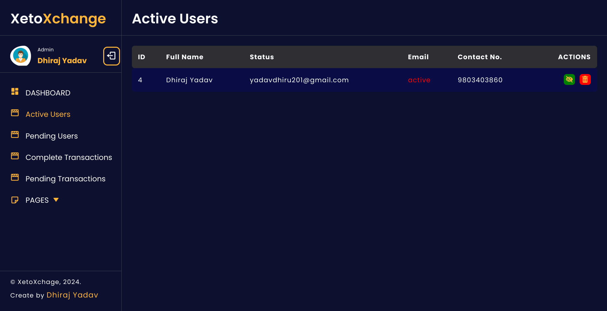

-----------------------------------------------------------------------------------------------------------------------------
<h3 align="center">Hi there😄</h3>

**You Can use this Beautiful Project for your college Project and get good marks too.**

Email me Now **yadavdhiru201@gmail.com** to get this Full Project Code, PPT, Report of this Project.
 
### HOW TO RUN THE PROJECT-
⚡ Email me at **yadavdhiru201@gmail.com** to get a detailed Guide report with Code to run the project with source Code.

### Need Code, Documents & Explanation video ? 

## How to Reach me :

### Mail : yadavdhiru201@gmail.com 

### WhatsApp: **+977 9803403860** (Helping 24*7) 

### Website : https://www.dhirajyadav.com.np
